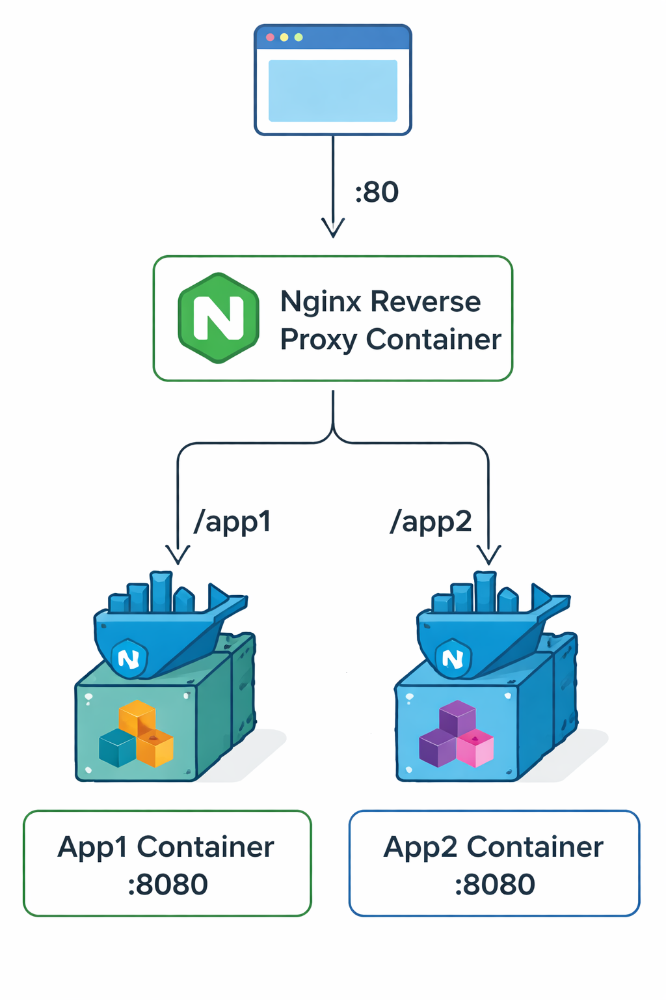

# Nginx Reverse Proxy Lab: Path-Based Routing

## Overview

This lab demonstrates professional reverse proxy configuration with Nginx, including path-based routing, backend service isolation, and Docker networking concepts used in production environments.

## What You'll Learn

- Configure Nginx as a reverse proxy with path-based routing
- Implement Docker internal DNS for service discovery
- Isolate backend services for security
- Troubleshoot common proxy issues (502 errors)
- Use production-ready reverse proxy patterns

## Architecture



```text
        ┌──────────────────────┐
        │   Host Machine       │
        │   Port 80 exposed    │
        └──────────┬───────────┘
                   │
                   ▼
        ┌──────────────────────┐
        │   nginx-proxy        │
        │   (0.0.0.0:80)       │
        │   Path routing:      │
        │   /app1/ → app1      │
        │   /app2/ → app2      │
        └──────────┬───────────┘
                   │
        ┌──────────┴──────────┐
        │    proxy-net        │
        │  (Docker network)   │
        └──────────┬──────────┘
                   │
        ┌──────────┴──────────┐
        │                     │
    ┌───▼──────┐      ┌───▼──────┐
    │  app1    │      │  app2    │
    │ (no port)│      │ (no port)│
    │ isolated │      │ isolated │
    └──────────┘      └──────────┘
```

## Prerequisites

- Docker installed and running
- Non-root Docker access
- Basic understanding of networking concepts
- Completion of Docker networking basics (Lab 1 recommended)

## Quick Start

1. Clone this repository
2. Navigate to this lab directory
3. Follow the step-by-step instructions in `steps.md`
4. Take screenshots as indicated for portfolio documentation

## Key Concepts Demonstrated

### Path-Based Routing

Route traffic to different backend services based on URL path:

- `/app1/` routes to app1 container
- `/app2/` routes to app2 container

### Backend Isolation

- Only the reverse proxy is exposed to the host
- Backend services run in an isolated network
- Reduces attack surface (security best practice)

### Docker DNS

- Containers resolve each other by name
- No hardcoded IP addresses needed
- Similar to Kubernetes service discovery

### Troubleshooting

- Intentional service failures to practice debugging
- Log analysis techniques
- Understanding 502 Bad Gateway errors

## Technologies Used

- **Nginx** - Reverse proxy and load balancer
- **Docker** - Containerization platform
- **nginxdemos/hello** - Lightweight demo application
- **Docker Networks** - Container networking and isolation

## Real-World Applications

This lab simulates patterns used in:

- Kubernetes Ingress Controllers
- AWS Application Load Balancer (ALB) path-based routing
- Azure Application Gateway routing rules
- API Gateway implementations
- Microservices architectures

## Interview Talking Points

After completing this lab, you can confidently discuss:

- "I configured Nginx as a reverse proxy with path-based routing, similar to Kubernetes Ingress or AWS ALB"
- "I isolated backend services by only exposing the proxy, reducing attack surface"
- "I used Docker's internal DNS for service discovery, avoiding hardcoded IPs"
- "I troubleshot 502 errors by analyzing proxy logs and upstream connectivity"

## Lab Structure

- `steps.md` - Detailed step-by-step instructions with explanations
- `nginx/default.conf` - Nginx reverse proxy configuration
- `screenshots/` - Directory for portfolio documentation (create during lab)

## Cleanup

To remove all resources created in this lab:

```bash
docker stop nginx-proxy app1 app2
docker rm nginx-proxy app1 app2
docker network rm proxy-net
```

## Next Steps

After mastering this lab, consider:

- Adding SSL/TLS termination
- Implementing load balancing across multiple backends
- Adding health checks
- Configuring rate limiting
- Implementing caching strategies

## License

This lab is part of the Linux Portfolio Labs series for DevOps learning.

## Author

DevOps Learning Labs - Portfolio Project Series
