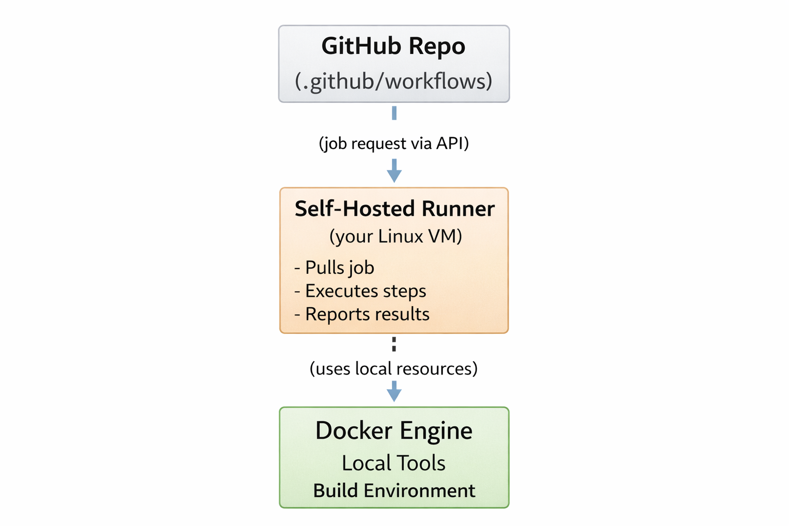

# Self-Hosted GitHub Actions Runner Lab

## Overview

This lab demonstrates how to configure and manage a self-hosted GitHub Actions runner on a Linux VM. You'll learn enterprise CI/CD infrastructure patterns by running GitHub Actions workflows on your own infrastructure instead of GitHub's shared runners.

## What You'll Learn

- Set up and configure GitHub Actions self-hosted runners
- Understand CI/CD architecture and workflow execution
- Manage runners as Linux systemd services
- Integrate Docker with CI/CD pipelines
- Implement failure recovery and monitoring
- Apply production-grade security practices

## Architecture



```text
┌─────────────────────┐
│   GitHub Repo       │
│   (.github/         │
│    workflows/)      │
└──────────┬──────────┘
           │
           │ (job request via API)
           │
           ▼
┌─────────────────────┐
│ Self-Hosted Runner  │
│ (your Linux VM)     │
│                     │
│ - Pulls job         │
│ - Executes steps    │
│ - Reports results   │
└──────────┬──────────┘
           │
           │ (uses local resources)
           │
           ▼
┌─────────────────────┐
│   Docker Engine     │
│   Local Tools       │
│   Build Environment │
└─────────────────────┘
```

## Prerequisites

- Linux VM (Azure VM, AWS EC2, or local VM)
- Docker installed and configured
- GitHub account and repository you control
- SSH access to your VM
- Basic understanding of Git, Docker, and CI/CD concepts

## Quick Start

1. Clone this repository
2. Navigate to this lab directory
3. Follow the step-by-step instructions in `steps.md`
4. Take screenshots as indicated for portfolio documentation

## Key Concepts Demonstrated

### Self-Hosted vs GitHub-Hosted Runners

| Feature       | GitHub-Hosted         | Self-Hosted                |
| ------------- | --------------------- | -------------------------- |
| Cost          | Minutes-based billing | Your infrastructure cost   |
| Control       | Limited               | Full control               |
| Customization | Standard images       | Custom everything          |
| Security      | Isolated              | Your responsibility        |
| Speed         | Variable              | Consistent (your hardware) |
| Hardware      | Fixed specs           | Choose your specs          |

### CI/CD Architecture

**Understanding the Flow:**

- GitHub doesn't run your jobs—your VM does
- Runner polls GitHub for jobs (pull model, not push)
- If your VM is down, pipelines fail
- This mirrors enterprise CI/CD infrastructure

### Service Management

- Runs as systemd service for production reliability
- Auto-starts on boot
- Automatic recovery from crashes
- Managed with standard Linux service tools

### Security Model

- Runner has full access to VM resources
- Can execute any code from workflow files
- Requires careful security configuration
- Best used with private repositories only

## Technologies Used

- **GitHub Actions** - CI/CD platform
- **Linux systemd** - Service management
- **Docker** - Containerization and build environments
- **Bash scripting** - Automation and monitoring
- **SSH** - Remote server management

## Real-World Applications

This lab simulates patterns used in:

- **Enterprise CI/CD**: Companies running their own build infrastructure
- **Cloud Build Systems**: AWS CodeBuild, Azure DevOps agents
- **GitLab Runners**: Same concept, different platform
- **Jenkins Agents**: Distributed build systems
- **Kubernetes CI/CD**: Tekton, Argo Workflows with custom executors

## Interview Talking Points

After completing this lab, you can confidently discuss:

- **"I configured self-hosted GitHub Actions runners on Linux VMs, managing them as systemd services with automatic recovery"**
- **"I implemented CI/CD pipelines with custom build environments, including Docker integration for containerized builds"**
- **"I tested failure scenarios including runner downtime, service crashes, and VM reboots to ensure pipeline reliability"**
- **"I applied security best practices for self-hosted runners, including dedicated user accounts and network restrictions"**
- **"I monitored runner health using systemd status checks and journalctl logging"**

## Lab Structure

- `steps.md` - Detailed step-by-step instructions with explanations
- `cleanup.md` - Proper teardown and resource cleanup procedures
- `ci-notes.md` - CI/CD concepts, best practices, and troubleshooting
- `assets/screenshots/` - Directory for portfolio documentation
- `.github/workflows/` - Example workflow files

## What You'll Build

By the end of this lab, you'll have:

1. ✅ A fully configured self-hosted GitHub Actions runner
2. ✅ Runner running as a production-grade systemd service
3. ✅ Working CI/CD pipeline executing on your infrastructure
4. ✅ Monitoring and health check scripts
5. ✅ Failure recovery procedures tested and documented
6. ✅ Security hardening implemented
7. ✅ Portfolio-ready screenshots and documentation

## Success Criteria

Your lab is complete when:

- [ ] Runner shows "Idle" status in GitHub UI
- [ ] Workflows execute successfully on your VM
- [ ] Runner survives VM reboots automatically
- [ ] You can troubleshoot and recover from failures
- [ ] Docker integration works in pipelines
- [ ] Service logs are accessible and understandable
- [ ] Security best practices are implemented

## Common Use Cases

### Building Docker Images

Run Docker builds on your own hardware with caching and custom registries.

### Running Integration Tests

Execute tests requiring databases, message queues, or other services running on your VM.

### Deploying Applications

Deploy directly from your VM to production environments with network access.

### GPU Workloads

Use runners with GPU access for ML model training or video processing.

### Large Builds

Run memory-intensive builds on VMs with 32GB+ RAM.

## Troubleshooting

Common issues and solutions:

| Problem                    | Solution                                               |
| -------------------------- | ------------------------------------------------------ |
| Runner shows offline       | Check service status: `sudo ./svc.sh status`           |
| Jobs queue but don't start | Verify labels match in workflow                        |
| Docker permission denied   | Add user to docker group                               |
| Disk space full            | Clean work directory and Docker images                 |
| Service won't start        | Check logs: `sudo journalctl -u actions.runner.*`      |

## Cleanup

To remove all resources:

```bash
# Stop and remove runner service
sudo ./svc.sh stop
sudo ./svc.sh uninstall

# Remove runner configuration
./config.sh remove

# Remove runner directory
cd ~
rm -rf actions-runner/
```

See `cleanup.md` for detailed teardown instructions.

## Next Steps

After mastering this lab, consider:

- Adding multiple runners for parallel job execution
- Implementing runner auto-scaling with cloud VMs
- Setting up ephemeral runners (destroy after each job)
- Configuring runner pools for different job types
- Integrating with monitoring tools (Prometheus, Grafana)
- Implementing secrets management with HashiCorp Vault
- Exploring Kubernetes-based runners with Actions Runner Controller

## Security Considerations

⚠️ **Important Security Notes:**

- Only use self-hosted runners with **private repositories**
- Public repositories can run untrusted code on your infrastructure
- Use dedicated user accounts without sudo access
- Implement network restrictions with firewall rules
- Regularly update runner software
- Monitor for suspicious activity in logs
- Use GitHub Secrets for sensitive data, never hardcode

## Performance Tips

- Use SSD storage for faster builds
- Allocate sufficient RAM (8GB+ recommended)
- Enable Docker BuildKit for faster image builds
- Use caching strategies in workflows
- Consider using multiple runners for parallel jobs
- Monitor resource usage and scale accordingly

## Monitoring and Maintenance

Regular maintenance tasks:

- Check runner health: `sudo ./svc.sh status`
- Review logs: `sudo journalctl -u actions.runner.* -f`
- Monitor disk space: `df -h`
- Clean old artifacts: `docker system prune -a`
- Update runner version when new releases available
- Test failure recovery procedures monthly

## Additional Resources

- [GitHub Actions Runner Documentation](https://docs.github.com/en/actions/hosting-your-own-runners)
- [Runner Security Hardening Guide](https://docs.github.com/en/actions/security-guides/security-hardening-for-github-actions)
- [Troubleshooting Self-Hosted Runners](https://docs.github.com/en/actions/hosting-your-own-runners/monitoring-and-troubleshooting-self-hosted-runners)
- [GitHub Actions Best Practices](https://docs.github.com/en/actions/learn-github-actions/best-practices-for-github-actions)

## Skills for Resume

After completing this lab, add these skills:

**Technical Skills:**

- GitHub Actions self-hosted runner configuration and management
- Linux systemd service administration
- CI/CD pipeline development and troubleshooting
- Docker integration with automated workflows
- Infrastructure as Code (IaC) for CI/CD
- System monitoring and log analysis

**Soft Skills:**

- Problem-solving through failure scenario testing
- Documentation of complex technical procedures
- Infrastructure reliability engineering
- Security-first mindset in automation

## License

This lab is part of the Linux Portfolio Labs series for DevOps learning.

## Author

DevOps Learning Labs - Portfolio Project Series

***BY VICTOR NWOKE***

---

**Ready to build production-grade CI/CD infrastructure? Start with `steps.md`!**
